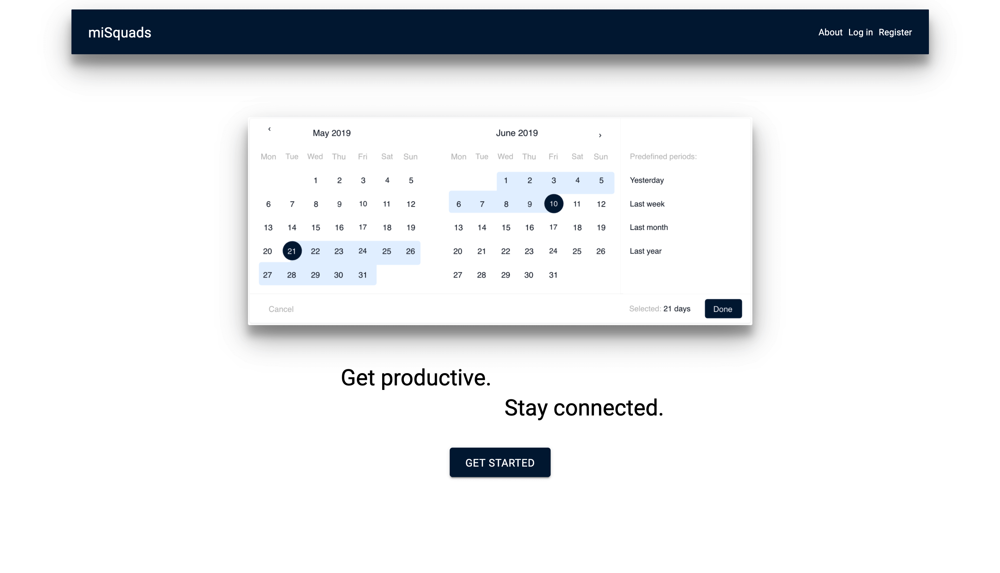
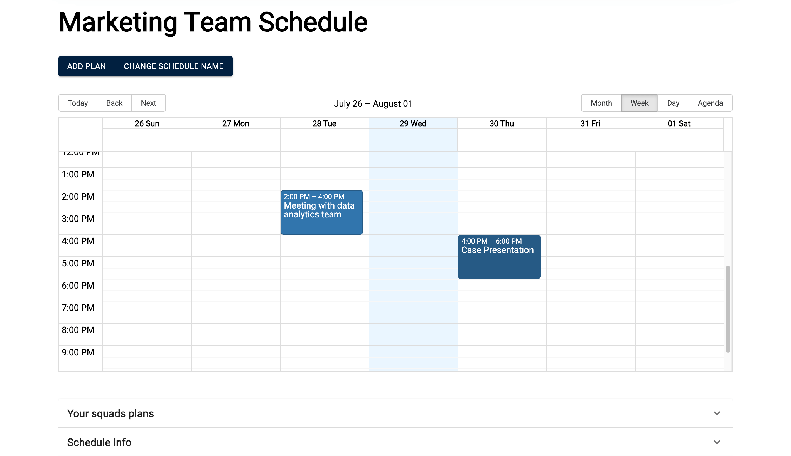

## miSquads

> Tool that keeps everyone on your team on the same page.

 

## Upcoming features

Creating interactive posts within your squad (likes, comments, polls), customizable team colors, and more!

## Usage

Rename "dummy.env" to ".env" in the root of the project and update the values to your own

## Install Dependencies

```
npm install
```

## Run app

```
# Run in dev mode
npm run dev

# Run frontend
npm run client

# Run backend
npm run server
```

- Version: 1.0
